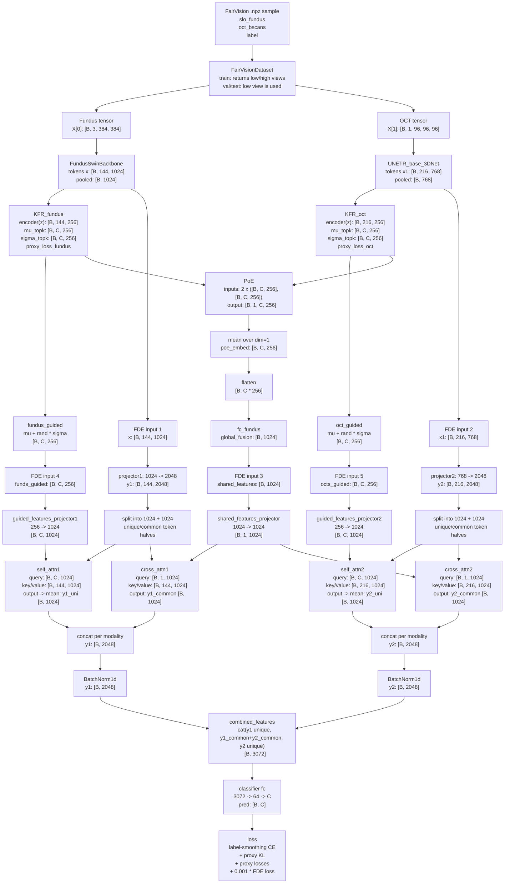
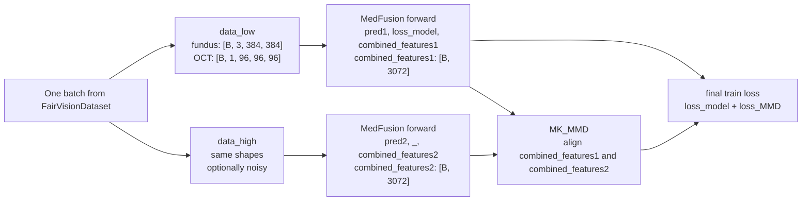

# MedFusion Dataflow And Tensor Shapes

This note summarizes the runnable root-path implementation:

- [data_fairvision.py](/home/liang/Robust-Multimodal-Learning-for-Ophthalmic-Disease-Grading-via-Disentangled-Representation/data_fairvision.py:43)
- [fusion_net.py](/home/liang/Robust-Multimodal-Learning-for-Ophthalmic-Disease-Grading-via-Disentangled-Representation/fusion_net.py:767)
- [fusion_train.py](/home/liang/Robust-Multimodal-Learning-for-Ophthalmic-Disease-Grading-via-Disentangled-Representation/fusion_train.py:193)
- [Models/fundus_swin_network.py](/home/liang/Robust-Multimodal-Learning-for-Ophthalmic-Disease-Grading-via-Disentangled-Representation/Models/fundus_swin_network.py:7)
- [Models/unetr.py](/home/liang/Robust-Multimodal-Learning-for-Ophthalmic-Disease-Grading-via-Disentangled-Representation/Models/unetr.py:21)

Assumptions in this diagram:

- `model_base=transformer`
- fundus input size: `384 x 384`
- OCT input size: `96 x 96 x 96`
- `B = batch size`
- `C = num_classes`, where `C=4` for AMD and `C=2` for DR/Glaucoma

## 1. Main Forward Graph



## 2. Training-Time Two-View Path



## 3. Shape Cheat Sheet

| Module | Input | Output |
| --- | --- | --- |
| `FairVisionDataset` | `.npz` | `X[0]: [B,3,384,384]`, `X[1]: [B,1,96,96,96]` |
| `FundusSwinBackbone` | `[B,3,384,384]` | tokens `[B,144,1024]`, pooled `[B,1024]` |
| `UNETR_base_3DNet` | `[B,1,96,96,96]` | tokens `[B,216,768]`, pooled `[B,768]` |
| `KFR_fundus` | `[B,144,1024]` | `z=[B,144,256]`, `mu/sigma=[B,C,256]` |
| `KFR_oct` | `[B,216,768]` | `z=[B,216,256]`, `mu/sigma=[B,C,256]` |
| `PoE` | two modalities of `[B,C,256]` | `[B,1,C,256]` |
| `fc_fundus` | `[B,C*256]` | `global_fusion=[B,1024]` |
| `FDE` | tokens + guided features + shared feature | `combined_features=[B,3072]` |
| `classifier fc` | `[B,3072]` | logits `[B,C]` |
| `MK_MMD` | two x `[B,3072]` | scalar alignment loss |

## 4. Notes For Reading The Code

- The current 3D backbone in [Models/unetr.py](/home/liang/Robust-Multimodal-Learning-for-Ophthalmic-Disease-Grading-via-Disentangled-Representation/Models/unetr.py:21) is a lightweight 3D Conv adapter that emits `216` tokens. It is not a full canonical UNETR implementation.
- In [fusion_net.py](/home/liang/Robust-Multimodal-Learning-for-Ophthalmic-Disease-Grading-via-Disentangled-Representation/fusion_net.py:60), `KFR` currently returns batch-repeated class proxy tensors `[B, C, 256]`; it is closer to proxy-guided regularization than a true sample-specific top-k selector.
- In [fusion_net.py](/home/liang/Robust-Multimodal-Learning-for-Ophthalmic-Disease-Grading-via-Disentangled-Representation/fusion_net.py:13), `PoE` still contains stale sampling code, but the actual returned tensor is `unsqueeze(mu) + unsqueeze(var)`, not a sampled tensor.
- In [fusion_train.py](/home/liang/Robust-Multimodal-Learning-for-Ophthalmic-Disease-Grading-via-Disentangled-Representation/fusion_train.py:193), training uses both low/high views and adds `MK_MMD`; validation and test only use the low/clean view.

## 5. Minimal ASCII View

```text
NPZ
 |- slo_fundus ------------------> [B, 3, 384, 384] --Swin--> [B, 144, 1024] --KFR--> [B, C, 256]
 |- oct_bscans ------------------> [B, 1, 96, 96, 96] --3DNet-> [B, 216, 768] --KFR--> [B, C, 256]

two [B, C, 256] --PoE--> [B, 1, C, 256] --mean/flatten/fc--> global_fusion [B, 1024]

([B, 144, 1024], [B, 216, 768], global_fusion [B, 1024], two guided [B, C, 256])
    --FDE--> combined_features [B, 3072]
    --fc--> logits [B, C]

train only:
    low view  -> combined_features1 [B, 3072]
    high view -> combined_features2 [B, 3072]
    MK_MMD(combined_features1, combined_features2)
```
